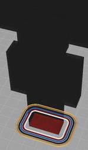
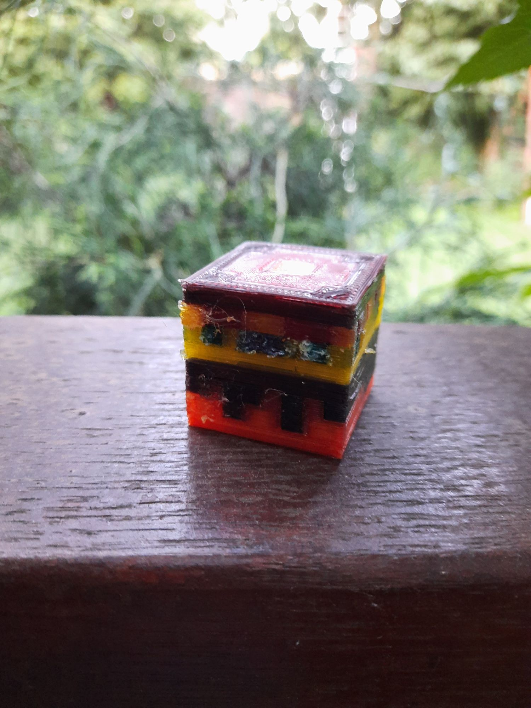
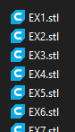
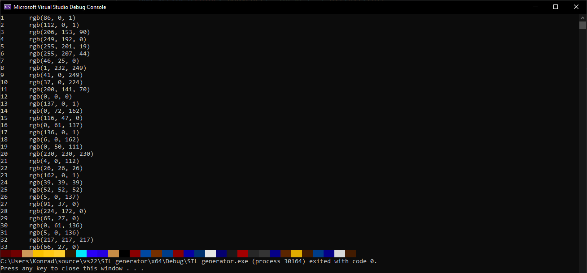

# MC-STL-generator


This example program can make any Minecraft skin 3D printable!

Here's the example skin's head, 3D printed on my makeshift abomination of a 3D printer:

...Poor quality is makeshift 3D printer's fault, not software's.



## Usage

Typically, your multicolor 3D printer should support more colors than your skin has.

If you are certain that's correct, you can skip Step 1.

### Step 1

If your printer supports **LESS** colors than your skin has - you can merge them!
 look for the following lines in `main.cpp`:
 
```C++
int max_colors{ 15 };
bool merge_colors{ false };
bool pause_to_edit{ false };
bool show_rgb_brackets{ true };
```
  1. set `merge_colors` to `true`
  2. set `max_colors` to the maximum amount of colors your printer supports
  
### Step 2
  
  1. Load this Visual Studio 2022 project & compile it.
  2. replace `STL generator/skin.png` with your own minecraft skin
  3. Run the program!
  
  In the `STL_output` folder you should see the list of all `.stl` files that you need to 3D print.
  
  
  
  Meanwhile, the console should display all of the colors that correspond to your files
  
  
  
  Each color should be applied to the stl file that has the same number.
  
  So, in my example, color `EX3.stl` corresponds to console's `3`, which is `rgb(206, 153, 90)`.
  
  Load your `.stl` files into your 3D printer's slicer and paste corresponding colors.
  
  Happy Printing!


    
