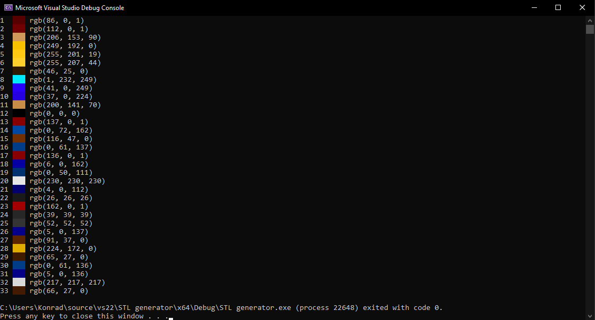

Those are legacy instructions, for generating `.stl` files instead of the modern `.3mf` format.

In order to use `.stl` files, change `desired_file_type` in `Settings.h` from `stl` to `3mf`

Program's output should now look like this:

In the `STL_output` folder you should see the list of all `.stl` files that you need to 3D print.
  
  
  
  Meanwhile, the console should display all of the colors that correspond to your files
  
  
  
  Each color should be applied to the stl file that has the same number.
  
  So, in my example, color `EX3.stl` corresponds to console's `3`, which is `rgb(206, 153, 90)`.
  
  Load your `.stl` files into your 3D printer's slicer and paste corresponding colors.
